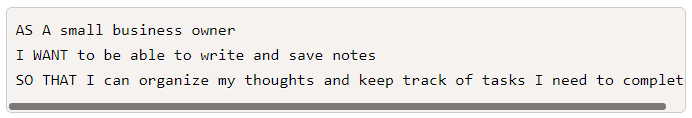
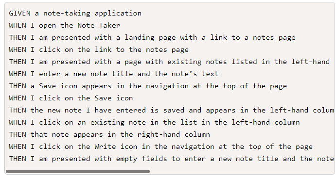
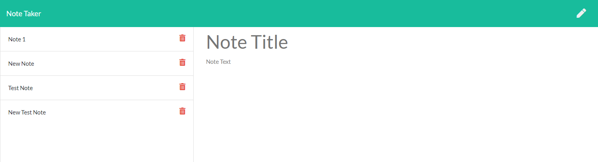

# Note Taker Starter Code

## User Story

## Acceptance Criteria

## Description
Application loads notes from a json file through an express server. After load, user can add new notes, load existing notes, or save notes. 

## Application References
[Deployed Heroku Application](https://mighty-tor-38638.herokuapp.com/)

[Application GitHub Repo](https://github.com/catse2000/note-keeper)

## Screenshot
